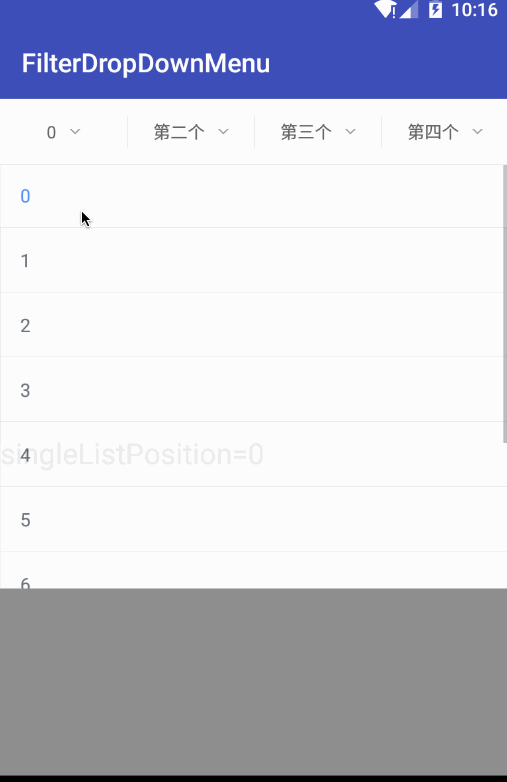

## DropDownMenu
This is a DropDownMenu with taking advantage of all dropDownMenus by others before,
I have written it for three times, Now the code is most clearly.

[中文文档](https://github.com/baiiu/DropDownMenu/blob/master/README-ZH.md)

##Feature
1. use Adapter to add the SubDropDownMenu. Override the `getView()` method to supply the wantted view.
2. use Generic to make all kinds of model(pojo,javabean...) can be used.
3. use FilterCheckedView which implements `Checkable`, so you can use selector to respond to all user action.
4. use FilterUrl to save the current choosen data, only override `toString()` you will get the url.

##ScreenShot



## Usage 
the xml: 
```
    <com.baiiu.filter.DropDownMenu
        android:id="@+id/filterDropDownView"
        android:layout_width="match_parent"
        android:layout_height="match_parent">

        <TextView
            android:id="@id/mFilterContentView" //mFilterContentView must be add into the view.the view can be a RecyclerView or others.
            android:layout_width="match_parent"
            android:layout_height="match_parent"
            android:gravity="center_vertical"
            android:textSize="22sp" />
    </com.baiiu.filter.DropDownMenu>
```

the javaCode:
```
    //set the Adapter.
    dropDownView.setMenuAdapter(new DropMenuAdapter(this, titleList));
```

the DropMenuAdapater:
```
 @Override
    public int getMenuCount() {
        return titles.length;
    }

    @Override
    public String getMenuTitle(int position) {
        return titles[position];
    }

    @Override
    public int getBottomMargin(int position) {
        return 0;
    }

    @Override
    public View getView(int position, FrameLayout parentContainer) {
        ...
        return createSingleListView();
    }
```

add a SingleListView:
```java

    private View createSingleListView() {
    
        SingleListView<String> singleListView = new SingleListView<String>(mContext)
                .adapter(new SimpleTextAdapter<String>(null, mContext) {
                    @Override
                    public String provideText(String string) {
                        return string;
                    }
                })
                .onItemClick(new OnFilterItemClickListener<String>() {
                    @Override
                    public void onItemClick(String item) {
                        FilterUrl.instance().singleListPosition = item;
    
                        FilterUrl.instance().position = 0;
                        FilterUrl.instance().positionTitle = item;
    
                        if (onFilterDoneListener != null) {
                            onFilterDoneListener.onFilterDone(0, "", "");
                        }
                    }
                });
                
        //初始化数据
        singleListView.setList(list, -1);//默认不选中
    }
```


